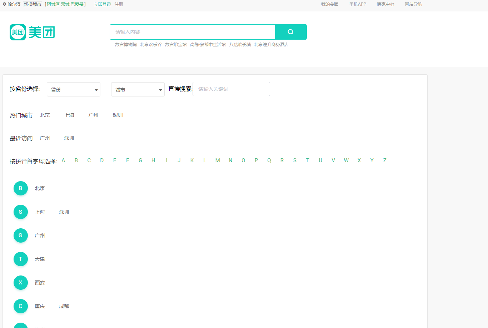

# mt-app

## Project setup
```
npm install
```

### Compiles and hot-reloads for development
```
npm run serve
```

### Compiles and minifies for production
```
npm run build
```

### Run your tests
```
npm run test
```

### Lints and fixes files
```
npm run lint
```
# 功能

## 注册


## 登录功能


## 首页


## 切换城市页



## 商品列表页

